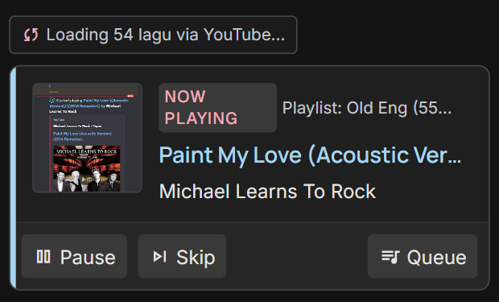

<div align="center">
  

  # 🎵 PinPlay Discord Music Bot

  Bot musik Discord modern dengan performa ultra-tinggi, antarmuka **Interactive Panel**, **29 Slash Commands**, dan ditenagai oleh **Lavalink v4** serta integrasi **NVIDIA AI API** dengan balutan **Premium Pastel UI** untuk streaming audio berkualitas tinggi tanpa lag.

  [](https://discord.js.org/)
  [](https://nodejs.org/)
  [](https://github.com/lavalink-devs/Lavalink)
  [](https://github.com/Gimm17/PinPlay-Bot)

  [✨ Fitur Utama](#-fitur-unggulan) • [🎨 Preview UI](#-preview-uiux-baru) • [⚡ Quick Start](#-quick-start) • [📜 Daftar Command](#-daftar-command-29)
</div>

---

## ✨ Fitur Unggulan

* 🎨 **Premium Pastel UI/UX** — Tampilan chat estetik dengan skema warna HSL soft pastel (Primary Blue `#A5D6F1` & Secondary Pink `#EFAAB9`). Semua respons pesan bot dikemas rapi dalam embed tanpa link tautan besar yang mengganggu.
* 🎛️ **Interactive Music Panel** — Kontrol pemutaran musik langsung melalui tombol interaktif di chat (Play, Pause, Skip, Volume, dll) tanpa mengetik.
* 🤖 **AI Playlist Generator** — Buat playlist lagu otomatis berdasarkan mood, tema, atau situasi (contoh: "lagu santai sore") lengkap dengan pilihan konfirmasi tombol.
* 🔥 **AI Savage Roast** — Dapatkan roasting lucu nan tajam dari AI yang menganalisis lagu aktif dan user yang me-request lagu tersebut.
* 🚀 **YouTube-Only Bypass (`/play-yt`)** — Putar lagu/playlist Spotify bebas hambatan dari *429 Rate Limit* menggunakan command khusus yang mem-bypass Spotify API langsung ke pencarian YouTube.
* 🎧 **Multi-Platform Audio** — Streaming lagu favorit Anda dari YouTube, Spotify, Apple Music, SoundCloud, dan lainnya melalui plugin Lavalink v4.
* 🔍 **Smart Search System** — Cari lagu dengan perintah `/search` dan pilih secara interaktif dari 5 hasil pencarian teratas.
* 🎤 **Live Lyrics** — Dapatkan lirik lagu secara instan dan otomatis saat musik sedang diputar dengan `/lyrics`.
* 📜 **Advanced Queue Management** — Kontrol penuh atas antrian lagu: *move*, *remove*, *skipto*, *clear*, dan *shuffle*.
* 🕒 **Mode 24/7 & Auto-Reconnect** — Bot tetap berada di Voice Channel meskipun antrian kosong, dan otomatis tersambung kembali setelah restart.
* 🎚️ **Built-in Audio Filters** — Aktifkan filter *Bassboost*, *Nightcore*, atau *Vaporwave* untuk pengalaman mendengar yang lebih seru.
* 🔐 **Sistem Akses Kontrol** — Batasi akses kontrol musik ke peran tertentu (DJ Role) atau pengguna pilihan Anda.
* 📜 **Song History** — Simpan riwayat hingga 15 lagu terakhir yang diputar di server Anda.

---

## 🎨 Preview UI/UX Baru (Before & After)

Berikut adalah perbandingan tampilan notifikasi pemutaran lagu sebelum dan sesudah redesain:

| ❌ Sebelum (Plain Text & Tautan Besar) |  Sesudah (Premium Pastel Embed) |
| :---: | :---: |
|  |  |

Selain itu, bot juga dilengkapi dengan **Interactive Music Panel** yang memudahkan Anda mengontrol lagu langsung lewat tombol chat:
<div align="center">
  
</div>

---

## ⚡ Quick Start

### Persyaratan:
- **Node.js** v18 atau lebih tinggi.
- **Java 17+** (diperlukan untuk menjalankan Lavalink server).

### Cara Menjalankan:

1. **Jalankan Lavalink Server**
   Pastikan Lavalink v4 telah berjalan di sistem Anda:
   ```bash
   java -jar Lavalink.jar
   ```

2. **Kloning & Instalasi Dependensi**
   ```bash
   npm install
   ```

3. **Konfigurasi Environment**
   Salin berkas konfigurasi `.env.example` ke `.env`:
   ```bash
   cp .env.example .env
   ```
   *Buka `.env` dan masukkan `DISCORD_TOKEN`, `CLIENT_ID`, serta `NVIDIA_API_KEY` (untuk fitur AI) Anda.*

4. **Daftarkan Slash Commands**
   ```bash
   # Mendaftarkan commands ke server uji coba Anda (instan)
   npm run deploy:guild

   # Atau daftarkan secara global ke seluruh server (membutuhkan waktu hingga 1 jam)
   npm run deploy:global
   ```

5. **Jalankan Bot**
   ```bash
   npm start
   ```

---

## 📜 Daftar Command (29)

### 🤖 Fitur AI (Opsional)
| Command | Deskripsi |
| :--- | :--- |
| `/aiplaylist [query]` | Membuat playlist lagu otomatis menggunakan AI berdasarkan mood atau tema |
| `/roast` | Me-roast secara savage lagu yang sedang diputar & pengguna yang me-request-nya |

### 🎵 Musik (Semua Pengguna)
| Command | Deskripsi |
| :--- | :--- |
| `/play <query>` | Memutar lagu/playlist berdasarkan judul, URL YouTube, Spotify, dll. |
| `/play-yt <query>` | Memutar lagu/playlist Spotify/YouTube via pencarian YouTube langsung (Bypass 429 Rate Limit). |
| `/search <query>` | Mencari lagu dan menampilkan 5 hasil pilihan interaktif. |
| `/nowplaying` | Menampilkan informasi detail tentang lagu yang sedang diputar. |
| `/lyrics [query]` | Menampilkan lirik lagu secara otomatis atau mencari manual. |
| `/queue [page]` | Menampilkan daftar antrian lagu saat ini. |
| `/history` | Menampilkan riwayat 15 lagu terakhir yang diputar. |
| `/help` | Menampilkan panduan bantuan bot umum. |
| `/helpv2 [mode]` | Menampilkan panduan khusus untuk perintah berbasis awalan (Prefix Commands). |

### 🎛️ Kontrol Pemutaran (Dapat Dibatasi)
| Command | Deskripsi |
| :--- | :--- |
| `/pause` / `/resume` | Menjeda atau melanjutkan pemutaran musik. |
| `/skip` / `/stop` | Melewati lagu aktif atau menghentikan pemutaran & menghapus antrian. |
| `/clear` | Membersihkan daftar antrian tanpa menghentikan lagu saat ini. |
| `/remove <posisi>` | Menghapus lagu tertentu dari antrian berdasarkan posisinya. |
| `/move <dari> <ke>` | Memindahkan posisi lagu di dalam antrian. |
| `/skipto <posisi>` | Langsung melompat ke lagu di posisi tertentu dalam antrian. |
| `/loop <mode>` | Mengatur mode perulangan: `off` / `track` / `queue`. |
| `/shuffle` | Mengacak urutan lagu di antrian. |
| `/volume <0-100>` | Mengatur volume suara pemutaran. |
| `/seek <detik>` | Lompat ke durasi waktu tertentu di lagu saat ini. |
| `/filter <nama>` | Mengaktifkan efek suara (Bassboost, Nightcore, Vaporwave). |
| `/leave` | Mengeluarkan bot dari Voice Channel secara paksa. |

### ⚙️ Pengaturan & Administrasi (Hanya Admin)
| Command | Deskripsi |
| :--- | :--- |
| `/panel <action>` | Membuat (`create`) atau menghapus (`delete`) Interactive Music Panel di chat. |
| `/access <subcommand>` | Mengatur mode akses musik (`public` atau `restricted`). |
| `/djrole <set\|view>` | Menentukan atau melihat peran (role) khusus DJ. |
| `/247 <enable>` | Mengaktifkan atau menonaktifkan mode standby 24/7 di Voice Channel. |

---

<div align="center">
  <h3>🤝 Berkontribusi & Dukungan</h3>
  
  Punya saran, kendala, atau ingin berkontribusi? Buka **Issue** atau buat **Pull Request**.

  *Dibuat dengan ❤️ untuk komunitas Discord.*
</div>
