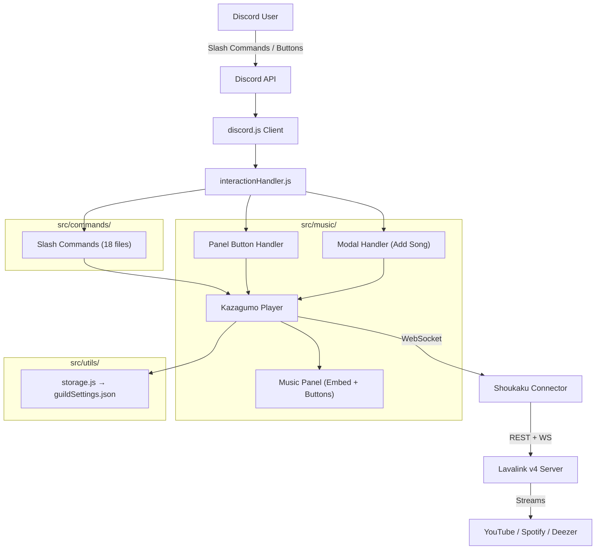
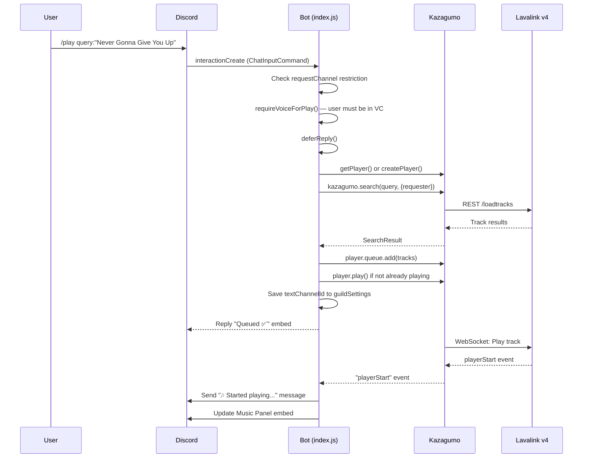

# 🎵 PinPlay Discord Music Bot — Full Analysis

## 1. Project Overview

| Item | Detail |
|---|---|
| **Name** | PinPlay |
| **Type** | Discord Music Bot |
| **Stack** | Node.js 18+ · discord.js v14 · Lavalink v4 · Kazagumo v3 (Shoukaku v4 wrapper) |
| **Module** | CommonJS (`"type": "commonjs"`) |
| **Total Files** | 28 source files (18 commands, 4 music modules, 4 utils, 2 handlers) |
| **Data Storage** | JSON file (`data/guildSettings.json`) |
| **External Dependency** | Lavalink v4 server (Java-based, runs separately) |

### Architecture Diagram



---

## 2. How It Works — Full Logic Flow

### 2.1. Startup Sequence
1. **`src/index.js`** loads env via `config.js` → validates required vars (`DISCORD_TOKEN`, `CLIENT_ID`, `LAVALINK_*`)
2. Creates Discord client with `Guilds` + `GuildVoiceStates` intents
3. `loadCommands()` scans `src/commands/*.js` → registers into `client.commands` Map
4. `createKazagumo()` initializes Kazagumo with Shoukaku connector → connects to Lavalink node
5. `attachMusicEvents()` hooks Kazagumo events (`playerStart`, `playerEnd`, `playerEmpty`, etc.)
6. `attachInteractionHandler()` hooks Discord `interactionCreate` for slash commands, buttons, and modals
7. On `ready` → sets bot presence to "Listening to music | /play"
8. On Lavalink node `ready` → restores 24/7 players from saved `guildSettings.json`

### 2.2. Playing Music Flow (`/play`)


### 2.3. Access Control Logic
```
/play                  → Everyone (just needs to be in VC)
Control commands       → Depends on controlMode setting:
  ├─ "all"             → Everyone in same VC as bot
  └─ "restricted"      → Only:
       ├─ Admin / ManageGuild permission
       ├─ DJ Role holder
       ├─ allowedUserIds list
       └─ allowedRoleIds list
Setup commands (/247, /access, /djrole, /panel)
                       → ManageGuild permission required (Discord-level)
```

### 2.4. Music Panel System
- `/panel create` sends a persistent embed + 2 rows of buttons (10 total) to the channel
- Panel message ID is saved in `guildSettings.json`
- Every music event (`playerStart`, `playerEnd`, `playerEmpty`, `playerDestroy`) triggers `updatePanel()` which edits the stored message
- Buttons: Shuffle, Prev, Pause/Resume, Next, Queue, Loop, Vol-, Vol+, Stop, Add Song
- "Add Song" opens a Modal for text input

### 2.5. 24/7 Mode
- `/247 enable:true` creates/reuses a player, saves `voiceChannelId` + `textChannelId`
- On bot restart → Lavalink `ready` event → reads all guilds from JSON → recreates players for `stay247: true` entries
- When 24/7 is ON, auto-leave timer is skipped

### 2.6. Auto-Leave Timer
- When `playerEnd` or `playerEmpty` fires and 24/7 is OFF → `scheduleLeave()` sets a timeout
- Default timeout: `config.leaveOnEmptyMs ?? 60_000` (⚠️ Bug — see below)
- After timeout → if queue still empty and not playing → `player.destroy()`

---

## 3. How to Run Locally

### Prerequisites
1. **Node.js 18+** — [nodejs.org](https://nodejs.org)
2. **Java 17+** — needed for Lavalink server
3. **Lavalink v4** — download from [github.com/lavalink-devs/Lavalink](https://github.com/lavalink-devs/Lavalink/releases)

### Step-by-Step

#### A. Setup Lavalink Server
```bash
# 1. Download Lavalink.jar (v4.x)
# 2. Create application.yml in same folder:
```
```yaml
# application.yml (minimal)
server:
  port: 2333
  address: 0.0.0.0
lavalink:
  server:
    password: "youshallnotpass"
    sources:
      youtube: true
      soundcloud: true
    plugins:
      - dependency: "com.github.topi314.lavasrc:lavasrc-plugin:4.0.1"
      - dependency: "dev.lavalink.youtube:youtube-plugin:1.5.2"
```
```bash
# 3. Run Lavalink
java -jar Lavalink.jar
```

#### B. Setup Bot
```powershell
# 1. Navigate to project
cd "c:\Users\HP\OneDrive\Documents\CODINGAN\BOT-DISCORD\PinPlay"

# 2. Install dependencies
npm install

# 3. Configure .env (already configured — check your DISCORD_TOKEN is valid)
# Edit .env if needed:
#   DISCORD_TOKEN=your_bot_token
#   CLIENT_ID=your_client_id
#   GUILD_ID=your_test_guild_id
#   LAVALINK_HOST=127.0.0.1
#   LAVALINK_PORT=2333
#   LAVALINK_PASSWORD=youshallnotpass

# 4. Deploy slash commands (guild = instant, global = up to 1hr delay)
npm run deploy:guild

# 5. Start the bot
npm start
```

> [!IMPORTANT]
> The Lavalink server MUST be running before/when the bot starts, otherwise music commands will fail with "No node found".

---

## 4. Free & Cheap Hosting Options

> [!WARNING]
> Truly free 24/7 hosting for **both** a Discord bot AND Lavalink is extremely difficult in 2025-2026. Most free tiers have sleep/spin-down or credit limits.

### Option A: Use Public Lavalink Nodes (Free, Unstable)
Host only the bot, use community Lavalink nodes:

| Provider | How |
|---|---|
| [lavalink-list (GitHub)](https://github.com/DarrenOfficial/lavalink-list) | Community-maintained list of free Lavalink v4 nodes |
| [darrennathanael.com](https://darrennathanael.com) | Categorized list with SSL/non-SSL |

→ Change `.env` to point to a public node. **Not stable for production.**

### Option B: Oracle Cloud Always Free (Best Free)
| Component | Oracle Free Tier |
|---|---|
| **VM** | 2 AMD VMs (1 GB RAM each) — permanently free |
| **Architecture** | Run Lavalink on one VM, Bot on another (or both on ARM VM with 4 cores / 24 GB) |
| **Uptime** | 24/7, no sleep |

→ **Best truly-free option** but requires Linux/SSH knowledge.

### Option C: Budget VPS ($3-5/month)
| Provider | Price | Specs |
|---|---|---|
| Hetzner | €3.29/mo | 2 vCPU, 2GB RAM |
| DigitalOcean | $4/mo | 1 vCPU, 512MB RAM |
| Contabo | $4.50/mo | 4 vCPU, 8GB RAM |

→ **Most reliable** approach. Run both Bot + Lavalink on one VPS.

### Option D: Split Architecture
| Bot Hosting | Lavalink |
|---|---|
| Railway free trial ($5 credit) | Public Lavalink node |
| Render free tier + UptimeRobot | Self-hosted on Oracle |

> [!TIP]
> **Recommended for you**: Oracle Cloud Always Free (ARM VM, 4 cores, 24GB RAM) — run both Bot + Lavalink. Or use a $5/month VPS if Oracle signup fails.

---

## 5. Bugs & Issues Found

### 🔴 Critical Bugs

#### BUG-1: Auto-Leave Timeout Uses Wrong Config Key
**File:** [events.js](file:///c:/Users/HP/OneDrive/Documents/CODINGAN/BOT-DISCORD/PinPlay/src/music/events.js#L26)
```javascript
// Line 26 — WRONG KEY
const timeoutMs = config?.leaveOnEmptyMs ?? 60_000;
```
The config object has `config.defaults.leaveTimeoutSec` (in seconds), but the code references `config.leaveOnEmptyMs` (doesn't exist). This means the timeout **always** falls back to 60 seconds (60,000ms), ignoring `LEAVE_TIMEOUT_SEC` from `.env`.

**Fix:**
```javascript
const timeoutMs = (config.defaults.leaveTimeoutSec ?? 120) * 1000;
```

---

#### BUG-2: Discord Token Exposed in `.env` (Committed to Repo)
**File:** [.env](file:///c:/Users/HP/OneDrive/Documents/CODINGAN/BOT-DISCORD/PinPlay/.env#L2)
The `.gitignore` includes `.env`, but the actual `.env` file with a **real Discord token** is present in the working directory. If this was ever pushed to a public repo, the token is compromised.

> [!CAUTION]
> **Regenerate this token immediately** on [Discord Developer Portal](https://discord.com/developers/applications). If it was ever pushed to Git, Discord may have already invalidated it.

---

#### BUG-3: `filter off` Hits Wrong Branch — Returns "❌ Filter tidak dikenal"
**File:** [filter.js](file:///c:/Users/HP/OneDrive/Documents/CODINGAN/BOT-DISCORD/PinPlay/src/commands/filter.js#L47-L55)
```javascript
const data = FILTERS[name]; // FILTERS.off = null

if (!data) {
  return interaction.reply({ content: "❌ Filter tidak dikenal.", ephemeral: true });
}

if (name === "off") {
  // This code is UNREACHABLE because data is null → caught by !data check above
```
`FILTERS["off"] = null` → `!null` is `true` → the "off" case is **never reached** and instead returns an error message.

**Fix:**
```javascript
if (name === "off") {
  await player.shoukaku.clearFilters();
  return interaction.reply({ content: "Filters cleared ✅", ephemeral: true });
}

const data = FILTERS[name];
if (!data) {
  return interaction.reply({ content: "❌ Filter tidak dikenal.", ephemeral: true });
}
```

---

#### BUG-4: Duplicate Lavalink Event Listeners
**Files:** [kazagumo.js](file:///c:/Users/HP/OneDrive/Documents/CODINGAN/BOT-DISCORD/PinPlay/src/music/kazagumo.js#L36-L45) + [index.js](file:///c:/Users/HP/OneDrive/Documents/CODINGAN/BOT-DISCORD/PinPlay/src/index.js#L37-L75)

Lavalink events (`ready`, `error`, `close`, `disconnect`) are registered **twice**:
1. Inside `createKazagumo()` (kazagumo.js L36-45)
2. In `index.js` (L37-75)

This causes duplicate log messages and the `ready` handler in `index.js` (which restores 24/7 players) runs in addition to the log-only handler in `kazagumo.js`.

**Fix:** Remove the event listeners from `kazagumo.js` and keep only the ones in `index.js` (which has the 24/7 restore logic).

---

### 🟡 Medium Issues

#### BUG-5: `guildSettings.json` Race Condition
**File:** [storage.js](file:///c:/Users/HP/OneDrive/Documents/CODINGAN/BOT-DISCORD/PinPlay/src/utils/storage.js)

Every `setGuildSettings()` call does a synchronous read → merge → write of the JSON file. If multiple interactions fire simultaneously (e.g., two users clicking panel buttons at once), they read the same state and the second write overwrites the first's changes.

---

#### BUG-6: `voiceChannelId` Saved with Text Channel ID
**File:** [guildSettings.json](file:///c:/Users/HP/OneDrive/Documents/CODINGAN/BOT-DISCORD/PinPlay/data/guildSettings.json#L15)
```json
"voiceChannelId": "1458111125697593509"  // This is actually a TEXT channel ID
```
Guild `1385253024670154912` has `voiceChannelId` set to the same ID as `textChannelId` and `panelChannelId`. This would cause the 24/7 restore to try joining a text channel as a voice channel → silent failure.

---

#### BUG-7: Prev Button Logic Can Duplicate Tracks
**File:** [panelInteractions.js](file:///c:/Users/HP/OneDrive/Documents/CODINGAN/BOT-DISCORD/PinPlay/src/music/panelInteractions.js#L107-L119)
```javascript
player.queue.unshift(current);   // put current back
player.queue.unshift(prev);      // put prev to front
await player.skip();             // skip to play prev
```
If `player.queue.previous` isn't properly managed by Kazagumo, or if the track was already in the queue, this can create duplicate entries. Also, `skip()` triggers `playerStart` which consumes the first queue item — but the current track was already pushed to queue, so it effectively stays.

---

#### BUG-8: `formatMs()` Duplicated 3 Times
**Files:** [nowplaying.js](file:///c:/Users/HP/OneDrive/Documents/CODINGAN/BOT-DISCORD/PinPlay/src/commands/nowplaying.js#L4-L11), [panel.js](file:///c:/Users/HP/OneDrive/Documents/CODINGAN/BOT-DISCORD/PinPlay/src/music/panel.js#L15-L23), [panelInteractions.js](file:///c:/Users/HP/OneDrive/Documents/CODINGAN/BOT-DISCORD/PinPlay/src/music/panelInteractions.js#L15-L22), [queue.js](file:///c:/Users/HP/OneDrive/Documents/CODINGAN/BOT-DISCORD/PinPlay/src/commands/queue.js#L6-L13)

Same `formatMs()`, `progressBar()`, and `thumb()` functions are copy-pasted across 4 files. This isn't a bug per se, but makes maintenance harder.

---

### 🟢 Minor Issues

#### BUG-9: No `.env.example` File
README references "Copy `.env.example` → `.env`" but no `.env.example` exists. New users have to guess the env vars.

---

#### BUG-10: `djrole view` Reply Not Ephemeral
**File:** [djrole.js](file:///c:/Users/HP/OneDrive/Documents/CODINGAN/BOT-DISCORD/PinPlay/src/commands/djrole.js#L27-L28)
`/djrole view` sends the response publicly, while similar admin commands (`/access view`) are ephemeral. Inconsistent UX.

---

#### BUG-11: `nowplaying` Not Marked as Control Command
**File:** [nowplaying.js](file:///c:/Users/HP/OneDrive/Documents/CODINGAN/BOT-DISCORD/PinPlay/src/commands/nowplaying.js)
The `/nowplaying` command doesn't go through `requireControl()` — any user can check what's playing even without being in VC. This may be intentional, but it's inconsistent with `/queue` which requires control access.

---

#### BUG-12: Vote Skip Defined But Never Implemented
**File:** [storage.js](file:///c:/Users/HP/OneDrive/Documents/CODINGAN/BOT-DISCORD/PinPlay/src/utils/storage.js#L51-L53)
```javascript
voteSkipEnabled: true,
voteSkipRatio: 0.5,
```
These defaults exist in the settings schema but there's zero implementation of vote skip anywhere in the codebase.

---

## 6. Code Quality Assessment

| Category | Score | Notes |
|---|---|---|
| **Structure** | ⭐⭐⭐⭐ | Clean separation: commands / music / handlers / utils |
| **Error Handling** | ⭐⭐⭐ | Most async calls have `.catch(() => null)` — silently swallows errors |
| **DRY Principle** | ⭐⭐ | `formatMs()`, `progressBar()`, `thumb()` duplicated 3-4x |
| **Security** | ⭐⭐ | Token in `.env` (good), but real token present in working dir. No rate limiting. |
| **Scalability** | ⭐⭐ | JSON file storage is single-server only. No clustering support. |
| **Documentation** | ⭐⭐⭐ | README is basic. Help command is comprehensive. No JSDoc. |
| **Logging** | ⭐⭐⭐ | Custom logger with levels. Good, but no log rotation or external sink. |

---

## 7. Feature Upgrade Suggestions

### 🎯 High Priority (Quick Wins)

| # | Feature | Description |
|---|---|---|
| 1 | **Vote Skip** | Implement the already-defined `voteSkipEnabled`/`voteSkipRatio`. Let users vote to skip — skip when ratio of VC members met. |
| 2 | **Lyrics** | Add `/lyrics` command using Genius API or lrclib.net. Show synced or static lyrics. |
| 3 | **Autoplay / Radio** | When queue empties, auto-search similar songs (Lavalink can recommend). Keeps music going without manual adds. |
| 4 | **Remove Track** | `/remove <position>` — remove a specific track from queue by index. |
| 5 | **Move Track** | `/move <from> <to>` — reorder tracks in queue. |
| 6 | **Clear Queue** | `/clear` — clear queue without stopping current track (unlike `/stop`). |

### 🔧 Medium Priority (Quality of Life)

| # | Feature | Description |
|---|---|---|
| 7 | **Favorites / Playlists** | Let users save personal playlists: `/fav add`, `/fav play`, `/fav list`. Store per-user in JSON or SQLite. |
| 8 | **Search with Selection** | `/search query` → show top 5 results as buttons/select menu → user picks which to play. Currently auto-picks first result. |
| 9 | **Embed Colors** | Add color theming to embeds (currently no color set = gray). Use branded colors for different states (playing=green, paused=yellow, error=red). |
| 10 | **Auto-Reconnect** | If bot disconnects from VC unexpectedly (network issue), auto-rejoin using saved channel ID. |
| 11 | **Skip To** | `/skipto <position>` — jump to a specific position in the queue, skipping everything before it. |
| 12 | **Now Playing Auto-Update** | Periodically edit the `/nowplaying` or panel embed to show real-time progress bar (every 15-30 seconds). |

### 🚀 Advanced Features

| # | Feature | Description |
|---|---|---|
| 13 | **SQLite/Better Storage** | Replace JSON file with `better-sqlite3` for concurrent access safety and better performance. |
| 14 | **Dashboard (Web UI)** | Build a simple web dashboard showing queue, controls, server stats. Use `express` + Discord OAuth2. |
| 15 | **Multi-Language** | i18n support — detect guild language or let admin set language preference. Currently mixed ID/EN. |
| 16 | **Spotify OAuth** | Direct Spotify playback instead of YouTube mirror. Requires Spotify Premium + LavaSrc config. |
| 17 | **Slash Command Autocomplete** | Add autocomplete for `/play` (search suggestions as user types) and `/help command:` (list command names). |
| 18 | **Song History** | Track recently played songs per guild. Add `/history` command. |
| 19 | **Disconnect Protection** | When bot is alone in VC for X seconds, either pause or leave (saves Lavalink resources). |

---

## 8. Summary Table

| Area | Status | Details |
|---|---|---|
| **Runnable Locally?** | ✅ Yes | Needs Lavalink v4 running separately + valid Discord token |
| **Free Hosting?** | ⚠️ Limited | Oracle Cloud Always Free is best option; public Lavalink for testing |
| **Critical Bugs** | 🔴 4 found | Auto-leave timeout wrong key, filter off unreachable, token exposure, duplicate events |
| **Medium Bugs** | 🟡 4 found | JSON race condition, wrong channel ID saved, prev button logic, code duplication |
| **Minor Issues** | 🟢 4 found | Missing env.example, inconsistent ephemeral, nowplaying access, dead vote skip config |
| **Feature Gaps** | 📝 19 suggested | Vote skip, lyrics, autoplay, favorites, search selection, web dashboard, etc. |

> [!IMPORTANT]
> **Tindakan Segera yang Disarankan:**
> 1. Regenerate Discord token jika pernah di-push ke Git
> 2. Fix BUG-1 (auto-leave timeout) — 1 line change
> 3. Fix BUG-3 (filter off) — move code block order  
> 4. Remove duplicate event listeners (BUG-4)
> 5. Create `.env.example` file

Mau saya langsung fix semua bug yang ditemukan, atau mau fokus ke salah satu area dulu (e.g., fix bugs saja, atau tambah fitur tertentu)?
